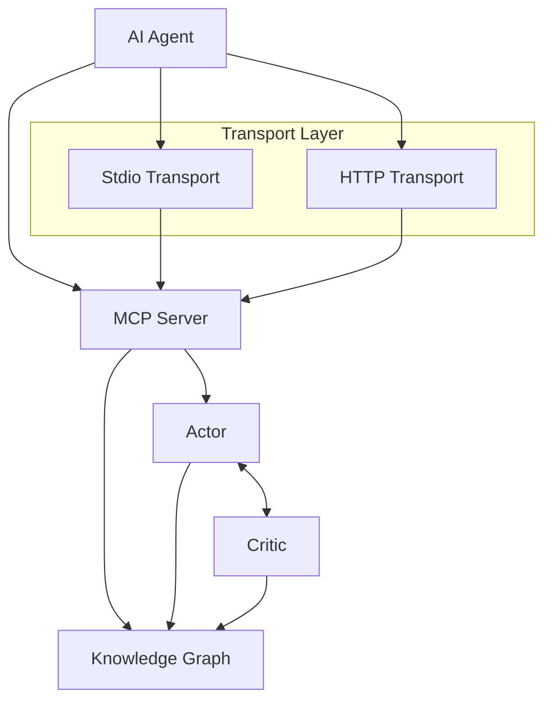

# CodeLoops Knowledge Base

*Comprehensive reference for project architecture, development, and planning*

---

## Table of Contents

1. [Project Overview](#project-overview)
2. [Core Architecture](#core-architecture)
3. [Current Implementation Status](#current-implementation-status)
4. [Known Challenges & Limitations](#known-challenges--limitations)
5. [Planned Improvements](#planned-improvements)
6. [Cross-Project Planning System](#cross-project-planning-system)
7. [Technical Specifications](#technical-specifications)
8. [Development Workflows](#development-workflows)
9. [MCP Tools Reference](#mcp-tools-reference)
10. [Data Structures](#data-structures)
11. [Troubleshooting](#troubleshooting)
12. [Performance Targets](#performance-targets)

---

## Project Overview

**CodeLoops** is an experimental actor-critic system designed to solve AI agent autonomy problems in software development. It addresses two critical failures in current coding agents:

- **Memory/Retrieval**: Context falls out of scope (forgotten APIs, duplicated components, dead code)
- **Credit Assignment**: Models can't link early decisions to later consequences (oscillating designs, mis-prioritized refactors)

### Key Value Propositions

- **Iterative Feedback**: Actor-critic system refines decisions in real-time
- **Knowledge Graph**: Persistent memory across sessions with semantic search
- **Seamless Integration**: MCP server enhances existing tools (Cursor, Claude, etc.)

---

## Core Architecture

### High-Level Components



### Component Details

#### 1. Knowledge Graph (`src/engine/KnowledgeGraph.ts`)
- **Purpose**: Persistent memory and context management
- **Storage**: Append-only NDJSON format at `data/knowledge_graph.ndjson`
- **Structure**: DAG (Directed Acyclic Graph) with parent-child relationships
- **Features**: Soft deletion, backup management, cycle detection
- **Performance**: Streaming APIs for efficient data access

#### 2. Actor (`src/agents/Actor.ts`)
- **Purpose**: Generates development thoughts and actions
- **Features**: 
  - Semantic tagging for searchability
  - Artifact linking (files created/modified)
  - Automatic git diff capture
  - Project context awareness

#### 3. Critic (`src/agents/Critic.ts`)
- **Purpose**: Reviews and validates actor thoughts
- **Verdicts**: `approved`, `needs_revision`, `reject`
- **Validation**: File reference checks, empty thought detection
- **Integration**: Python agent for sophisticated code review

#### 4. Summarizer (`src/agents/Summarize.ts`)
- **Purpose**: Compresses knowledge graph for manageable context
- **Trigger**: Every 20 nodes
- **Method**: Python agent generates concise summaries
- **Benefit**: Maintains performance with growing knowledge base

### Actor-Critic Workflow

1. **Actor Phase**: Developer creates thought via `actor_think`
   - Semantic tagging (requirement, task, file-modification)
   - Artifact linking for file references
   - Git diff capture
   - Knowledge graph persistence

2. **Critic Phase**: Automatic review triggered
   - Basic validation (empty thoughts, missing artifacts)
   - Python agent deep analysis
   - Verdict with reasoning
   - Critic node linked to actor node

3. **Iteration**: Based on feedback
   - Approved: Continue to next thought
   - Needs revision: Refine and resubmit
   - Rejected: Reconsider approach

---

## Current Implementation Status

### Version: 0.5.1
### Active Branch: `ms/agent-migration`

### Migration Status
- **Breaking Change**: Transitioning from per-project JSON to centralized NDJSON
- **Timeline**: Implementation across 5 phases
- **Completion**: Ongoing (estimated ~7 days for full migration)
- **Migration Script**: Available for existing data conversion

### Functional Components
- ✅ Basic actor-critic workflow
- ✅ Knowledge graph persistence
- ✅ MCP tool integration
- ✅ Git diff capture
- ✅ HTTP/Stdio transport support

### Known Working Features
- Actor thought creation with semantic tagging
- Automatic critic review triggering
- Knowledge graph streaming operations
- Project context management
- Basic artifact linking

---

## Known Challenges & Limitations

### 1. Temporal Difference Problems
- **Issue**: Agents forget previously designed components
- **Symptoms**: Duplicate work, component recreation, context loss
- **Root Cause**: Insufficient memory recall (20-step window)
- **Impact**: High - Core functionality affected

### 2. Critic System Limitations
- **Issue**: Critics act as "rubber stamps" without meaningful evaluation
- **Missing**: Duplicate detection, semantic validation, quality gates
- **Example**: No detection of @ts-expect-error overuse
- **Impact**: Medium - Quality control compromised

### 3. Persistence Scalability
- **Issue**: Legacy JSON files don't scale
- **Problems**: Full graph loading, memory constraints, data loss
- **Example**: "prismatic work" data loss incidents
- **Impact**: High - Data integrity concerns

### 4. Agent Behavior Problems
- **Issue**: Agents don't reuse existing schemas/components
- **Symptoms**: Redundant type/hook separation, false dead code claims
- **Root Cause**: Poor context retrieval mechanisms
- **Impact**: Medium - Code quality degradation

### 5. System Architecture Gaps
- **Issue**: Single project support, unused features
- **Missing**: Vector search, rule enforcement, metrics tracking
- **Impact**: Low - Feature completeness

---

## Planned Improvements

### High Priority (Breaking Changes)

#### 1. Knowledge Graph Redesign
- **Goal**: Centralized NDJSON persistence
- **Changes**: Remove ProjectManager, streaming operations
- **Timeline**: Phase 1-2 of migration
- **Breaking**: No backward compatibility

#### 2. Enhanced Critic Agent
- **Features**: Duplicate detection (85% threshold), semantic validation
- **Goal**: Meaningful quality gates vs rubber stamping
- **Timeline**: Post-migration Phase 3

#### 3. Metrics Tracking Framework
- **Metrics**: Performance, duplicate detection, save failures
- **Goal**: <1ms logging overhead, 100% accuracy
- **API**: Query interface for analysis

### Medium Priority

#### 4. Cross-Project Planning System ⭐ NEW FEATURE
- **Goal**: Enable seamless planning and execution across multiple interconnected projects
- **Features**: 
  - Unified plan management spanning 5-6 repositories
  - Persistent planning context across project switches
  - Intelligent dependency context augmentation
  - Cross-project workflow continuity
- **Timeline**: 12-week implementation plan
- **Value**: Solves core developer pain point in multi-repository environments
- **Implementation**: See detailed checklist artifact for comprehensive roadmap

#### 5. Active Retrieval Tools
- **Tools**: `search_plan`, `get_artifact`, vector search
- **Goal**: Solve context retrieval problems
- **Integration**: Pinecone or similar vector DB

#### 6. Multi-Project Support (Enhanced)
- **Features**: Project switching, caching, isolation, plan-aware context
- **Target**: <1s switching, no cross-project leaks, plan continuity
- **Timeline**: Integrated with Cross-Project Planning System

#### 7. Code Consistency Agent
- **Features**: Dead code detection, type/hook collocation
- **Method**: AST analysis, git diff verification
- **Goal**: Verify actor claims against reality

### Lower Priority

#### 8. Developer CLI
- **Features**: Graph visualization, export tools, plan dashboards
- **Formats**: JSON, SVG output, plan reports
- **Timeline**: Post v1.0

#### 9. Rule Enforcement System
- **Features**: Priority tagging, automatic validation
- **Goal**: Solve "rules ignored" problem
- **Method**: Penalty system for violations

---

## Cross-Project Planning System

### Overview
The Cross-Project Planning System addresses a fundamental challenge in modern software development: coordinating work across multiple interconnected repositories and workstations. Based on developer feedback (June 2025 transcription), this system enables seamless planning and execution workflows that span 5-6 different projects.

### Core Problem Solved
Developers frequently work on software that lives across multiple repositories, requiring them to:
- Context switch between different codebases while maintaining workflow continuity
- Understand dependencies and relationships between projects
- Coordinate changes that affect multiple repositories
- Maintain a coherent view of progress across distributed development

### Key Features

#### 1. Unified Plan Management
- **Cross-Repository Plans**: Create plans that span multiple projects with persistent context
- **Workflow Continuity**: Start work in Project A, continue in Project B, complete in Project C
- **Plan Templates**: Predefined patterns for common cross-project workflows
- **Phase Management**: Break plans into project-specific phases with dependencies

#### 2. Intelligent Context Augmentation
- **Dependency Detection**: Automatically identify project relationships and dependencies
- **Smart Context Injection**: Provide relevant information from dependent projects when needed
- **API Context**: Surface external service definitions and recent changes
- **Change Impact**: Track how modifications in one project affect others

#### 3. Cross-Project Workflow Support
- **Plan-Aware Actor**: Actor thoughts automatically link to active plans
- **Context Switching**: Seamless transitions between projects within the same plan
- **Progress Tracking**: Unified view of plan progress across all involved repositories
- **Dependency Validation**: Ensure plan consistency and detect conflicts

### Technical Architecture

#### Data Models
```typescript
interface Plan {
  id: string;
  title: string;
  description: string;
  projects: string[];              // Project paths involved
  status: 'planning' | 'active' | 'completed' | 'paused';
  phases: PlanPhase[];
  dependencies: ProjectDependency[];
  createdAt: string;
  updatedAt: string;
}

interface PlanPhase {
  id: string;
  title: string;
  projectPath: string;
  status: 'pending' | 'active' | 'completed' | 'blocked';
  prerequisites: string[];         // Other phase IDs
  nodes: string[];                 // Associated node IDs
}

interface CrossProjectRef {
  projectPath: string;
  nodeId?: string;
  artifactPath?: string;
  description: string;
  type: 'dependency' | 'context' | 'output';
}
```

#### Extended DagNode Structure
```typescript
interface DagNode {
  // ... existing fields ...
  planId?: string;                 // Link to plan
  planRole?: 'plan' | 'execution' | 'context';
  crossProjectRefs?: CrossProjectRef[];
}
```

### New MCP Tools

#### Plan Management
- `create_plan` - Create new cross-project plan
- `list_plans` - List plans with filtering options
- `get_plan` - Retrieve plan details with progress
- `update_plan` - Modify plan metadata and associations
- `switch_plan_context` - Change active plan for session

#### Context & Dependencies
- `scan_dependencies` - Analyze project dependencies
- `get_dependency_context` - Fetch relevant context from dependencies
- `get_next_actions` - Suggest next steps based on plan state
- `sync_plan_status` - Refresh progress from all projects

#### Plan Execution
- `create_phase` - Add execution phases to plans
- `complete_phase` - Mark phases complete and advance workflow
- `validate_plan` - Check plan consistency and dependencies
- `generate_plan_report` - Create progress and analytics reports

### Implementation Timeline

**Phase 1-2 (Weeks 1-4): Foundation**
- Extend data structures and storage layer
- Implement core plan management tools
- Plan-aware actor system integration

**Phase 3-4 (Weeks 5-8): Context System**
- Dependency detection and scanning
- Context augmentation service
- Smart context injection in actor workflows

**Phase 5-6 (Weeks 9-12): Advanced Features**
- Plan execution intelligence
- Cross-project synchronization
- Analytics, reporting, and optimization

### Success Metrics
- **Plan Completion Rate**: >85% of created plans completed
- **Context Switch Time**: <1s between projects within a plan
- **Dependency Context Accuracy**: >90% relevant context provided
- **Developer Satisfaction**: Reduced cognitive load in multi-repo work

### Integration with Existing Architecture
- **Knowledge Graph**: Plans stored in extended NDJSON format
- **Actor-Critic**: Plan-aware thought creation and validation
- **MCP Tools**: New tools alongside existing actor_think workflow
- **Project Management**: Enhanced multi-project support

---

## Technical Specifications

### Dependencies
- **Runtime**: Node.js 22+, Python 3.8+, uv package manager
- **MCP**: @modelcontextprotocol/sdk v1.11.0
- **HTTP**: Fastify v5.2.0
- **Validation**: Zod v3.24.3
- **Logging**: Pino v9.6.0

### File Structure
```
codeloops/
├── src/
│   ├── agents/           # Actor, Critic, Summarize
│   ├── engine/           # KnowledgeGraph core
│   ├── server/           # MCP transport layer
│   └── utils/            # Git, project utilities
├── agents/
│   ├── critic/           # Python critic agent
│   └── summarize/        # Python summarize agent
├── data/                 # Knowledge graph storage
├── docs/                 # Documentation
└── scripts/              # Setup and migration
```

### Storage Format
- **Primary**: `data/knowledge_graph.ndjson` (append-only)
- **Deleted**: `data/knowledge_graph.deleted.ndjson`
- **Backups**: `data/backup/` with timestamps
- **Capacity**: ~10MB per 1,000 nodes

### Transport Options
- **Stdio**: Default, direct process communication
- **HTTP**: Alternative, port 3000 default, Fastify-based

---

## Development Workflows

### Standard Development Process
1. Use `npm run setup` for initial installation
2. Start server: `npm start` (stdio) or `npm run start:http`
3. Connect via MCP configuration in your agent
4. Use `actor_think` for all development thoughts
5. Let critic provide automatic feedback
6. Run `npx tsc --noEmit --skipLibCheck` after code changes

### Code Standards
- **TypeScript**: Strict mode, no explicit any
- **Linting**: ESLint with Prettier formatting
- **Testing**: Vitest for unit tests
- **Commits**: Conventional commits with commitlint

### Agent Integration Example
```json
{
  "mcp": {
    "servers": {
      "codeloops": {
        "type": "stdio",
        "command": "npx",
        "args": ["-y", "tsx", "/path/to/codeloops/src"]
      }
    }
  }
}
```

---

## MCP Tools Reference

### Primary Tools

#### `actor_think`
**Purpose**: Create actor nodes with automatic critic review
**Parameters**:
- `thought` (required): The development thought/action
- `projectContext` (required): Full path to project directory
- `tags` (required): Semantic categories array
- `artifacts` (required): Array of file references

**Example**:
```typescript
{
  thought: "Implement user authentication with JWT tokens",
  projectContext: "/path/to/project",
  tags: ["task", "authentication", "security"],
  artifacts: [{"name": "Auth Service", "path": "src/auth/service.ts"}]
}
```

#### `resume`
**Purpose**: Fetch recent project context
**Parameters**:
- `projectContext` (required): Project path
- `limit` (optional): Number of nodes to return
- `includeDiffs` (optional): "all" | "latest" | "none"

### Utility Tools

#### `critic_review`
**Purpose**: Manual critic review of specific node
**Parameters**:
- `actorNodeId` (required): Node ID to review
- `projectContext` (required): Project path

#### `get_node`
**Purpose**: Retrieve specific node by ID
**Parameters**:
- `id` (required): Node UUID

#### `export`
**Purpose**: Export knowledge graph data
**Parameters**:
- `projectContext` (required): Project path
- `limit` (optional): Node limit

#### `list_projects`
**Purpose**: List all available projects
**Parameters**:
- `projectContext` (optional): Highlight current project

#### `delete_thoughts`
**Purpose**: Soft delete nodes with dependency checking
**Parameters**:
- `nodeIds` (required): Array of node IDs
- `projectContext` (required): Project path
- `confirm` (optional): Confirm deletion
- `reason` (optional): Deletion reason

---

## Data Structures

### DagNode (Core Knowledge Unit)
```typescript
interface DagNode {
  id: string;                    // UUID identifier
  project: string;               // Project name
  projectContext: string;        // Full project path
  thought: string;               // Content/description
  role: 'actor' | 'critic' | 'summary';
  verdict?: 'approved' | 'needs_revision' | 'reject';
  verdictReason?: string;        // Critic reasoning
  target?: string;               // For critic: reviewed node ID
  parents: string[];             // Parent node IDs
  children: string[];            // Child node IDs
  createdAt: string;             // ISO timestamp
  tags?: string[];               // Semantic categories
  artifacts?: ArtifactRef[];     // Linked files
  diff?: string;                 // Git diff snapshot
  summarizedSegment?: string[];  // For summary nodes
}
```

### ArtifactRef (File Reference)
```typescript
interface ArtifactRef {
  name: string;         // Human-readable name
  path: string;         // File system path
  uri?: string;         // Optional external link
  hash?: string;        // Content hash
  contentType?: string; // MIME type
}
```

### Common Tags
- `requirement` - User requirements/specifications
- `task` - Development tasks
- `file-modification` - File creation/updates
- `bug-fix` - Bug resolution
- `refactoring` - Code restructuring
- `testing` - Test implementation
- `documentation` - Documentation updates
- `architecture` - System design decisions

---

## Troubleshooting

### Common Issues

#### "Failed to parse JSON from uv mcp-server-fetch"
- **Cause**: Python agent communication error
- **Solution**: Check Python environment, verify uv installation
- **Prevention**: Use `npm run setup` for proper configuration

#### Data Loss / Node Not Found
- **Cause**: Knowledge graph corruption or incomplete writes
- **Solution**: Check `data/backup/` for recent backups
- **Prevention**: Regular backups, use atomic writes

#### Memory Issues with Large Projects
- **Cause**: Full graph loading into memory
- **Solution**: Use streaming APIs, implement pagination
- **Workaround**: Regular summarization (every 20 nodes)

#### Critic Always Approves
- **Current State**: Known limitation - critics lack sophistication
- **Workaround**: Manual review of critical changes
- **Fix**: Enhanced critic implementation (roadmap item #2)

### Performance Issues

#### Slow Project Loading
- **Check**: NDJSON file size (`data/knowledge_graph.ndjson`)
- **Solution**: Implement summarization, archive old projects
- **Target**: <1s load time for <10k nodes

#### High Memory Usage
- **Check**: Node count via `export` tool
- **Solution**: Stream processing, lazy loading
- **Target**: <1GB for 10k nodes

### Development Issues

#### TypeScript Errors After Changes
- **Command**: `npx tsc --noEmit --skipLibCheck`
- **Common**: Missing imports, type mismatches
- **Fix**: Follow existing patterns, check similar files

#### MCP Connection Failures
- **Check**: Server process running, correct configuration
- **Stdio**: Verify command path in MCP config
- **HTTP**: Confirm port availability, firewall settings

---

## Performance Targets

### Current Benchmarks
- **Node Creation**: <50ms per thought
- **Critic Review**: <2s with Python agent
- **Graph Query**: <100ms for recent nodes
- **Project Load**: Variable (depends on size)

### Target Metrics (Post-Migration)
- **Data Integrity**: 100% success rate for saves
- **Query Latency**: <100ms for all operations
- **Duplicate Detection**: 95% accuracy at 85% threshold
- **Memory Usage**: <1GB for 10k nodes
- **Cache Hit Rate**: 80% for multi-project operations
- **Project Switching**: <1s between projects

### Monitoring
- **Logging**: Pino-based structured logs
- **Metrics**: Planned metrics framework
- **Alerts**: File system events, error rates
- **Analysis**: Query API for performance data

---

## Future Vision

### Short Term (Next 3 months)
- Complete NDJSON migration
- Implement enhanced critic system
- Add metrics tracking
- Stabilize multi-project support

### Medium Term (3-6 months)
- Vector search integration
- Advanced retrieval tools
- Rule enforcement system
- Developer CLI tools

### Long Term (6+ months)
- ML-based code quality scoring
- Automated refactoring suggestions
- Cross-project knowledge sharing
- Enterprise deployment options

---

**Last Updated**: June 2025 | **Version**: 0.5.1 | **Status**: Active Development

*This knowledge base serves as the single source of truth for CodeLoops project understanding, planning, and development activities.*