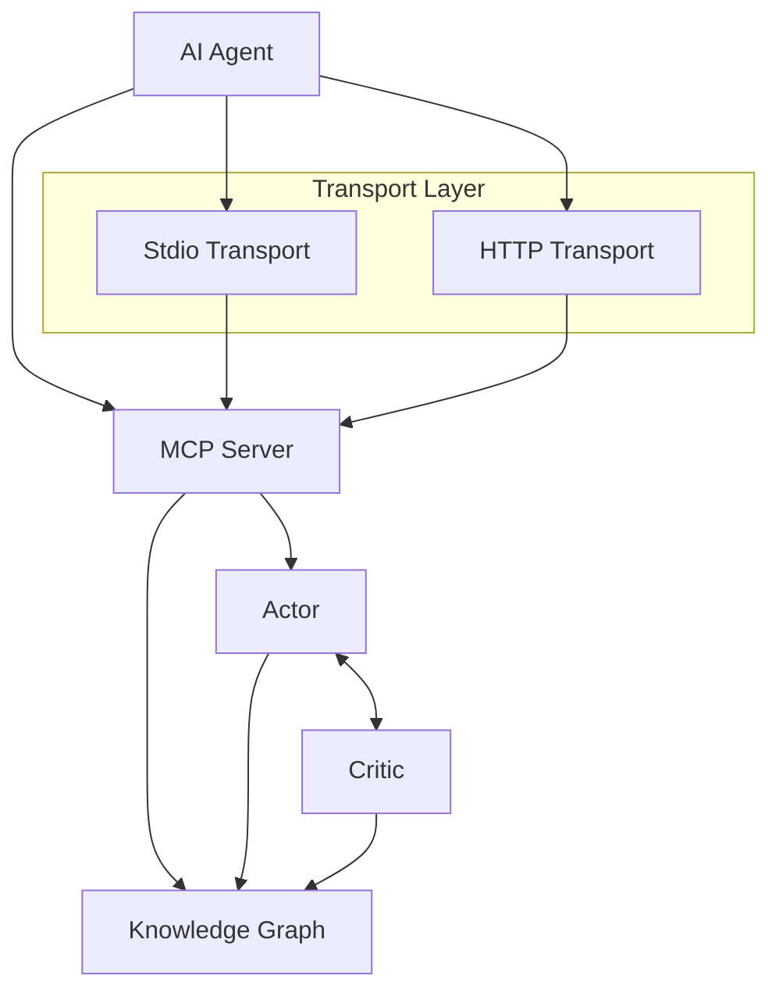

# CodeLoops Knowledge Base

*Current state reference for project architecture and implementation (main branch)*

---

## Table of Contents

1. [Project Overview](#project-overview)
2. [Core Architecture](#core-architecture)
3. [Current Implementation Status](#current-implementation-status)
4. [Known Challenges & Limitations](#known-challenges--limitations)
5. [Technical Specifications](#technical-specifications)
6. [Development Workflows](#development-workflows)
7. [MCP Tools Reference](#mcp-tools-reference)
8. [Data Structures](#data-structures)
9. [Troubleshooting](#troubleshooting)
10. [Performance Benchmarks](#performance-benchmarks)

---

## Project Overview

**CodeLoops** is an experimental actor-critic system designed to solve AI agent autonomy problems in software development. It addresses two critical failures in current coding agents:

- **Memory/Retrieval**: Context falls out of scope (forgotten APIs, duplicated components, dead code)
- **Credit Assignment**: Models can't link early decisions to later consequences (oscillating designs, mis-prioritized refactors)

### Key Features

- **Iterative Feedback**: Actor-critic system refines decisions in real-time
- **Knowledge Graph**: Persistent memory across sessions with semantic search
- **Seamless Integration**: MCP server enhances existing tools (Cursor, Claude, etc.)

---

## Core Architecture

### High-Level Components



### Component Details

#### 1. Knowledge Graph (`src/engine/KnowledgeGraph.ts`)
- **Purpose**: Persistent memory and context management
- **Storage**: Append-only NDJSON format at `data/knowledge_graph.ndjson`
- **Structure**: DAG (Directed Acyclic Graph) with parent-child relationships
- **Features**: Soft deletion, backup management, cycle detection
- **Performance**: Streaming APIs for efficient data access

#### 2. Actor (`src/agents/Actor.ts`)
- **Purpose**: Generates development thoughts and actions
- **Features**: 
  - Semantic tagging for searchability
  - Artifact linking (files created/modified)
  - Automatic git diff capture
  - Project context awareness

#### 3. Critic (`src/agents/Critic.ts`)
- **Purpose**: Reviews and validates actor thoughts
- **Verdicts**: `approved`, `needs_revision`, `reject`
- **Validation**: File reference checks, empty thought detection
- **Integration**: Python agent for sophisticated code review

#### 4. Summarizer (`src/agents/Summarize.ts`)
- **Purpose**: Compresses knowledge graph for manageable context
- **Trigger**: Every 20 nodes
- **Method**: Python agent generates concise summaries
- **Benefit**: Maintains performance with growing knowledge base

### Actor-Critic Workflow

1. **Actor Phase**: Developer creates thought via `actor_think`
   - Semantic tagging (requirement, task, file-modification)
   - Artifact linking for file references
   - Git diff capture
   - Knowledge graph persistence

2. **Critic Phase**: Automatic review triggered
   - Basic validation (empty thoughts, missing artifacts)
   - Python agent deep analysis
   - Verdict with reasoning
   - Critic node linked to actor node

3. **Iteration**: Based on feedback
   - Approved: Continue to next thought
   - Needs revision: Refine and resubmit
   - Rejected: Reconsider approach

---

## Current Implementation Status

### Version: 0.5.1

### Functional Components
- ✅ Basic actor-critic workflow
- ✅ Knowledge graph persistence
- ✅ MCP tool integration
- ✅ Git diff capture
- ✅ HTTP/Stdio transport support

### Working Features
- Actor thought creation with semantic tagging
- Automatic critic review triggering
- Knowledge graph streaming operations
- Project context management
- Basic artifact linking
- Python agent integration for critic and summarizer
- Soft deletion with dependency checking

---

## Known Challenges & Limitations

### 1. Memory Retrieval Problems
- **Issue**: Agents forget previously designed components
- **Symptoms**: Duplicate work, component recreation, context loss
- **Root Cause**: Limited context window, no proactive retrieval
- **Impact**: High - Core functionality affected

### 2. Critic System Limitations
- **Issue**: Critics lack sophisticated evaluation
- **Missing**: Duplicate detection, semantic validation, quality gates
- **Current State**: Basic validation only (empty thoughts, file references)
- **Impact**: Medium - Quality control limited

### 3. Persistence Architecture
- **Issue**: Per-project JSON files becoming NDJSON
- **Problems**: Full graph loading into memory
- **Current**: Transitioning to streaming NDJSON format
- **Impact**: Medium - Scalability improving

### 4. Agent Behavior
- **Issue**: Poor context utilization
- **Symptoms**: Components not reused, redundant implementations
- **Root Cause**: No semantic search or retrieval tools
- **Impact**: Medium - Code quality affected

### 5. Feature Gaps
- **Missing**: Vector search, metrics tracking, multi-project support
- **Current**: Single project focus, basic search only
- **Impact**: Low - Core functionality works

---

## Technical Specifications

### Dependencies
- **Runtime**: Node.js 22+, Python 3.8+, uv package manager
- **MCP**: @modelcontextprotocol/sdk v1.11.0
- **HTTP**: Fastify v5.2.0
- **Validation**: Zod v3.24.3
- **Logging**: Pino v9.6.0

### File Structure
```
codeloops/
├── src/
│   ├── agents/           # Actor, Critic, Summarize
│   ├── engine/           # KnowledgeGraph core
│   ├── server/           # MCP transport layer
│   └── utils/            # Git, project utilities
├── agents/
│   ├── critic/           # Python critic agent
│   └── summarize/        # Python summarize agent
├── data/                 # Knowledge graph storage
├── docs/                 # Documentation
└── scripts/              # Setup and migration
```

### Storage Format
- **Primary**: `data/knowledge_graph.ndjson` (append-only)
- **Deleted**: `data/knowledge_graph.deleted.ndjson`
- **Backups**: `data/backup/` with timestamps
- **Capacity**: ~10MB per 1,000 nodes

### Transport Options
- **Stdio**: Default, direct process communication
- **HTTP**: Alternative, port 3000 default, Fastify-based

---

## Development Workflows

### Standard Development Process
1. Use `npm run setup` for initial installation
2. Start server: `npm start` (stdio) or `npm run start:http`
3. Connect via MCP configuration in your agent
4. Use `actor_think` for all development thoughts
5. Let critic provide automatic feedback
6. Run `npx tsc --noEmit --skipLibCheck` after code changes

### Code Standards
- **TypeScript**: Strict mode, no explicit any
- **Linting**: ESLint with Prettier formatting
- **Testing**: Vitest for unit tests
- **Commits**: Conventional commits with commitlint

### Agent Integration Example
```json
{
  "mcp": {
    "servers": {
      "codeloops": {
        "type": "stdio",
        "command": "npx",
        "args": ["-y", "tsx", "/path/to/codeloops/src"]
      }
    }
  }
}
```

---

## MCP Tools Reference

### Primary Tools

#### `actor_think`
**Purpose**: Create actor nodes with automatic critic review
**Parameters**:
- `thought` (required): The development thought/action
- `projectContext` (required): Full path to project directory
- `tags` (required): Semantic categories array
- `artifacts` (required): Array of file references

**Example**:
```typescript
{
  thought: "Implement user authentication with JWT tokens",
  projectContext: "/path/to/project",
  tags: ["task", "authentication", "security"],
  artifacts: [{"name": "Auth Service", "path": "src/auth/service.ts"}]
}
```

#### `resume`
**Purpose**: Fetch recent project context
**Parameters**:
- `projectContext` (required): Project path
- `limit` (optional): Number of nodes to return
- `includeDiffs` (optional): "all" | "latest" | "none"

### Utility Tools

#### `critic_review`
**Purpose**: Manual critic review of specific node
**Parameters**:
- `actorNodeId` (required): Node ID to review
- `projectContext` (required): Project path

#### `get_node`
**Purpose**: Retrieve specific node by ID
**Parameters**:
- `id` (required): Node UUID

#### `export`
**Purpose**: Export knowledge graph data
**Parameters**:
- `projectContext` (required): Project path
- `limit` (optional): Node limit

#### `list_projects`
**Purpose**: List all available projects
**Parameters**:
- `projectContext` (optional): Highlight current project

#### `delete_thoughts`
**Purpose**: Soft delete nodes with dependency checking
**Parameters**:
- `nodeIds` (required): Array of node IDs
- `projectContext` (required): Project path
- `confirm` (optional): Confirm deletion
- `reason` (optional): Deletion reason

---

## Data Structures

### DagNode (Core Knowledge Unit)
```typescript
interface DagNode {
  id: string;                    // UUID identifier
  project: string;               // Project name
  projectContext: string;        // Full project path
  thought: string;               // Content/description
  role: 'actor' | 'critic' | 'summary';
  verdict?: 'approved' | 'needs_revision' | 'reject';
  verdictReason?: string;        // Critic reasoning
  target?: string;               // For critic: reviewed node ID
  parents: string[];             // Parent node IDs
  children: string[];            // Child node IDs
  createdAt: string;             // ISO timestamp
  tags?: string[];               // Semantic categories
  artifacts?: ArtifactRef[];     // Linked files
  diff?: string;                 // Git diff snapshot
  summarizedSegment?: string[];  // For summary nodes
}
```

### ArtifactRef (File Reference)
```typescript
interface ArtifactRef {
  name: string;         // Human-readable name
  path: string;         // File system path
  uri?: string;         // Optional external link
  hash?: string;        // Content hash
  contentType?: string; // MIME type
}
```

### Common Tags
- `requirement` - User requirements/specifications
- `task` - Development tasks
- `file-modification` - File creation/updates
- `bug-fix` - Bug resolution
- `refactoring` - Code restructuring
- `testing` - Test implementation
- `documentation` - Documentation updates
- `architecture` - System design decisions

---

## Troubleshooting

### Common Issues

#### "Failed to parse JSON from uv mcp-server-fetch"
- **Cause**: Python agent communication error
- **Solution**: Check Python environment, verify uv installation
- **Prevention**: Use `npm run setup` for proper configuration

#### Data Loss / Node Not Found
- **Cause**: Knowledge graph corruption or incomplete writes
- **Solution**: Check `data/backup/` for recent backups
- **Prevention**: Regular backups, use atomic writes

#### Memory Issues with Large Projects
- **Cause**: Full graph loading into memory
- **Solution**: Use streaming APIs, implement pagination
- **Workaround**: Regular summarization (every 20 nodes)

#### Critic Always Approves
- **Current State**: Known limitation - critics lack sophistication
- **Workaround**: Manual review of critical changes
- **Note**: Basic validation works (empty thoughts, file references)

### Performance Issues

#### Slow Project Loading
- **Check**: NDJSON file size (`data/knowledge_graph.ndjson`)
- **Solution**: Implement summarization, archive old projects
- **Current**: Variable based on project size

#### High Memory Usage
- **Check**: Node count via `export` tool
- **Solution**: Stream processing, lazy loading
- **Current**: Full graph loading

### Development Issues

#### TypeScript Errors After Changes
- **Command**: `npx tsc --noEmit --skipLibCheck`
- **Common**: Missing imports, type mismatches
- **Fix**: Follow existing patterns, check similar files

#### MCP Connection Failures
- **Check**: Server process running, correct configuration
- **Stdio**: Verify command path in MCP config
- **HTTP**: Confirm port availability, firewall settings

---

## Performance Benchmarks

### Current Measured Performance
- **Node Creation**: <50ms per thought
- **Critic Review**: <2s with Python agent
- **Graph Query**: <100ms for recent nodes
- **Project Load**: Variable (depends on size)

### System Characteristics
- **Storage**: ~10MB per 1,000 nodes in NDJSON format
- **Memory**: Full graph loading (scalability concern)
- **Logging**: Pino-based structured logs
- **File I/O**: Append-only for main graph

---

**Last Updated**: June 2025 | **Version**: 0.5.1 | **Status**: Active Development

*This knowledge base documents the current state of CodeLoops on the main branch for planning and development reference.*