# Actor–Critic MCP

Actor–Critic loop for coding agents, consolidating knowledge graph memory & sequential thinking into more useful tooling.

## Why this exists

Modern coding agents forget what they wrote a few minutes ago **and** can’t trace which early design choice broke the build four moves later.

That’s two separate failures:

| Layer                  | Failure                                      | Symptom set                                                               |
| ---------------------- | -------------------------------------------- | ------------------------------------------------------------------------- |
| **Memory / Retrieval** | Context falls out of scope                   | forgotten APIs • duplicated components • dead code • branch drift         |
| **Credit Assignment**  | Model can’t link early moves to late rewards | oscillating designs • premature optimisations • mis‑prioritised refactors |

LLMs _learn_ with actor–critic loops that solve temporal difference and credit assignment problems, but tool builders drop that loop at inference time.

Actor–Critic MCP attempts to bring it back **and** closes the memory hole.

Keep in mind: Memory issues ≠ Temporal‑Difference issues

---

### AI Agent Context Gaps

Here is a short catalogue of problems I have encountered pair-programming with AI agents.

#### **Memory loss & retrieval**

1. **Forgetting prior definitions** – APIs, schemas, or components fall outside the window and get reinvented.
2. **Rules / guidelines ignored** – Rule files (`.rules.md`, ESLint, naming docs) are rarely pulled into context or linked to reward, so conventions drift.
3. **Unstructured or missing summaries** – Older work isn’t compacted, so long‑range reasoning decays.
4. **No proactive retrieval** – Tools like `resume` or `search_plan` aren’t invoked, leaving blind spots.
5. **Forgetting exploration outcomes** – Rejected ideas resurface; time is wasted on déjà‑vu fixes.
6. **Buried open questions** – “TBD” items never resurface, so design gaps remain unresolved.

#### **Consistency & integrity drift**

7. **Component duplication / naming drift** – Same concept, new name; specs splinter.
8. **Weak code linkage** – Thoughts aren’t tied to artifacts; the agent doubts or overwrites its own work.
9. **Dead code & divergence from plan** – Unused files linger; implementation strays from intent.
10. **Poor hygiene routines** – No systematic search/reuse/tag cycle → metadata rot.
11. **Loss of intent hierarchy** – Downstream tasks optimise locally and break upstream goals.
12. **Stale assumptions** – New requirements don’t invalidate old premises; bad foundations spread.
13. **Branch divergence without reconciliation** – Parallel fixes never merge; logic conflicts.
14. **No cross‑branch dependency tracking** – Change auth model here, tests fail over there.

Have more problems to add? File an issue to suggest adding to the list.

## What this project is

```mermaid
%% Actor–Critic MCP high‑level flow
graph TD
  A[Caller Agent Copilot, Cursor, ...] --> B[MCP Server]
  B --> C[Knowledge-Graph Memory]
  B --> D[Actor]
  D <--> E[Critic]
  D --> C
  E --> C
```

High‑level flow: caller → MCP → KG + Actor/Critic loop

- **Coding Agent**  
  Calls the actor critic mcp
- **Knowledge Graph**  
  Compact summaries + full artefacts; fast semantic lookup; survives crashes.
- **Actor**  
  Generates the next code / plan node. Writes links into the graph.
- **Critic**  
  Scores each node against long‑horizon goals; updates value estimates; can veto or request revision.
- **Hot‑Context Stream**  
  Only the freshest, highest‑value nodes return to the LLM to keep within token budgets.

## Current status

| Area                                | State          |
| ----------------------------------- | -------------- |
| KG schema & basic mcp tools         | ✔ working      |
| Sequential thinker (Actor v0)       | ✔ working      |
| Basic Critic with rule‑based reward | 🚧 in progress |

See **[`notes/next_steps.md`](notes/next_steps.md)** for detail.

I am still developing & testing this out in my workflows.

After I put some more miles on it, I will add the quick start instructions to this README.

## Background

While the context gap is not directly a temporal difference problem, it lends itself to the concepts of temporal difference and credit assignment.
So it is helpful to understand these concepts in order to solve the context gaps.

**TLDR;**

TD = delayed reward.  
Credit assignment = which earlier step deserves the reward.  
Actor–Critic solves both: Actor acts, Critic scores, value propagates back.

### What is a temporal difference problem?

An example: when an AI wins or loses a game of chess, it might not remember the specific moves it made earlier in the game that led to that outcome. This is a temporal difference problem, the result comes much later than the decisions that influenced it.

This ties directly into another concept: the credit assignment problem.

---

**What is the credit assignment problem?**

To build on the example above: how does the AI figure out which specific moves actually contributed to the win or loss? Not all moves mattered equally. The AI needs to assign credit (or blame) across a timeline of actions.

---

**How do the two connect?**

The temporal difference problem is about **delayed consequences**. Decisions made now might not show their results until much later.
The credit assignment problem is about **figuring out which of those decisions mattered most** when the result finally does come.

Together, they form one of the most challenging problems in long-horizon reasoning.

---

**How was this solved?**

This was a sticky problem for a long time, but one of the more effective approaches turned out to be the actor–critic model.

Here’s how it works:

- The **actor** is responsible for making decisions (moves, in the chess example).
- The **critic** provides feedback. It evaluates whether those decisions seem likely to lead to a good outcome.
- If the critic believes the actor’s move is good, the actor continues. If not, the actor tries a better move.

Over time, the actor learns which moves tend to lead to good results, even if the payoff comes much later. This model helps the AI assign value to intermediate steps, instead of only learning from the final outcome.

So for our purposes, the actor is the coding agent, and the critic is made available via an MCP. I am hoping to figure out how we might tie rewards back to agent moves(ie; code gen).

---

###  License & contributing

This project is entirely experimental. Use at your own risk. & do what you want with it.

MIT see [license](LICENSE)
